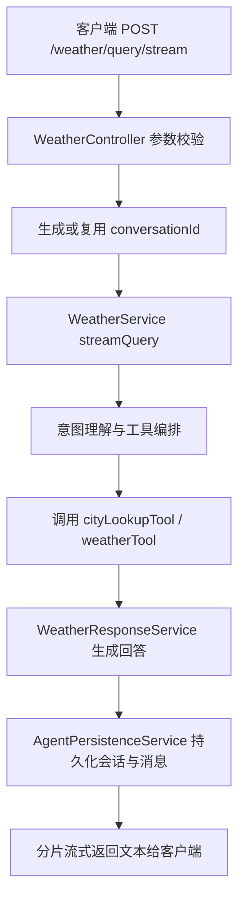
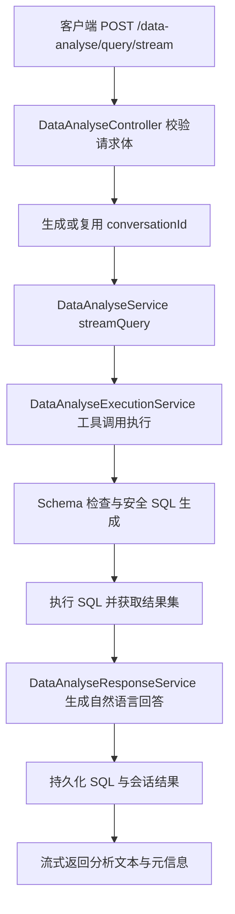
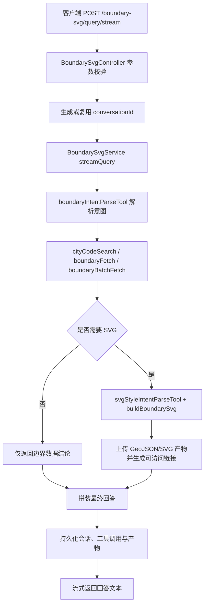

# Agents

基于 NestJS 的 AI 服务后端，提供用户登录、支付宝授权、验证码、图片上传、LangChain 调用和天气 Agent 查询能力。

## 功能模块

- 用户模块：支持账号注册、账号密码登录、邮箱验证码登录、用户资料查询与更新、管理员用户列表。
- 支付宝授权模块：支持通过支付宝 `authCode` 登录，并获取支付宝用户信息。
- 通用模块：提供健康检查、图形验证码、邮箱验证码和图片上传能力。
- LangChain 模块：提供大模型调用状态检查和基础 prompt 调用接口。
- 天气 Agent 模块：基于 OpenAI 兼容接口和 QWeather 工具查询天气，并生成自然语言出行建议。

## 技术栈

- Node.js + TypeScript
- NestJS 11
- TypeORM + PostgreSQL
- JWT + Passport
- LangChain / OpenAI 兼容接口
- AWS S3 兼容对象存储（缤纷云）

## 环境准备

安装依赖：

```bash
pnpm install
```

在项目根目录创建 `.env`，按需配置以下变量：

```bash
# 服务配置
PORT=3000
NODE_ENV=development
FRONTEND_ORIGIN=http://localhost:5173
SESSION_SECRET=your-session-secret

# PostgreSQL
DB_HOST=127.0.0.1
DB_PORT=5432
DB_USERNAME=postgres
DB_PASSWORD=your_password
DB_NAME=agents

# JWT
JWT_SECRET=your-jwt-secret
JWT_EXPIRES_IN=1d

# 邮箱验证码
EMAIL_PASS=your-email-smtp-auth-code

# OpenAI 兼容接口
OPENAI_API_KEY=your-api-key
OPENAI_MODEL=gpt-4o-mini

# 天气查询（QWeather）
WEATHER_API_TOKEN=your-qweather-token
WEATHER_API_HOST=https://your-qweather-host

# 支付宝授权
APP_PRIVATE_KEY=your-alipay-app-private-key
ALIPAY_PUBLIC_KEY=your-alipay-public-key

# 对象存储（可选，有默认值）
BITIFUL_BUCKET=your-bucket
BITIFUL_PREFIX=ai-agent
BITIFUL_ENDPOINT=https://s3.bitiful.net
BITIFUL_PUBLIC_BASE_URL=
BITIFUL_REGION=auto
BITIFUL_ACCESS_KEY_ID=your-access-key
BITIFUL_SECRET_ACCESS_KEY=your-secret-key
```

## 启动项目

```bash
# 开发模式
pnpm run start

# 监听模式
pnpm run start:dev

# 生产模式
pnpm run build
pnpm run start:prod
```

服务启动后默认监听 `http://localhost:3000`，全局接口前缀为 `/ai-service`。

## 鉴权说明

项目启用了全局 JWT 鉴权。除注册、登录、验证码、图片上传和健康检查等白名单接口外，请求需要在 Header 中携带登录返回的 token：

```bash
Authorization: Bearer <token>
```

成功响应会被统一包装为：

```json
{
  "success": true,
  "data": {},
  "code": 200,
  "feature": "user"
}
```

## Agent 介绍

### Weather Agent（天气问答）

- 作用：结合城市信息、自然语言问题和天气工具，生成可读的天气结论与出行建议。
- 输入方式：支持 `city`、`question`、`message` 等多种查询参数组合。
- 配置依赖：需要 `OPENAI_API_KEY`、`WEATHER_API_TOKEN`、`WEATHER_API_HOST`。
- 主要接口：`POST /ai-service/weather/query/stream`（`status` 仅用于配置状态检查）。

#### 业务流程图



### Data Analyse Agent（数据分析）

- 作用：围绕数据库 Schema 进行安全 SQL 生成与执行，并返回结构化分析结果。
- 适用场景：报表查询、业务数据探索、面向问题的快速数据核对。
- 配置依赖：需要可用的 PostgreSQL 连接配置以及大模型相关配置。
- 主要接口：`POST /ai-service/data-analyse/query/stream`（`status` 仅用于配置状态检查）。

#### 业务流程图



### Boundary SVG Agent（行政区边界 SVG 生成）

- 作用：根据地理边界查询和样式意图，生成可用于可视化场景的 SVG 边界图形。
- 能力特点：支持行政区识别、批量边界获取、样式解析与图形产物输出。
- 配置依赖：依赖大模型配置，部分流程需要外部地图/边界数据源能力。
- 主要接口：`POST /ai-service/boundary-svg/query/stream`（`status` 仅用于配置状态检查）。

#### 业务流程图



## 测试与代码检查

```bash
# 单元测试
pnpm run test

# e2e 测试
pnpm run test:e2e

# 覆盖率
pnpm run test:cov

# ESLint 自动修复
pnpm run lint

# 格式化
pnpm run format
```

## 目录结构

```text
src/
  agents/
    langchain/      # LangChain 基础调用
    weather/        # 天气 Agent、天气工具和提示词
    tools/          # 通用 Agent 工具
  alipay-auth/      # 支付宝授权登录
  common/           # 鉴权、异常过滤器、响应拦截器等公共能力
  general/          # 验证码、邮箱验证码、图片上传
  lib/              # 对象存储、验证码等基础服务
  user/             # 用户实体、DTO、服务和控制器
```

## 注意事项

- TypeORM 当前开启了 `synchronize: true`，生产环境请谨慎使用。
- PostgreSQL 默认端口为 `5432`，可通过 `DB_PORT` 覆盖，数据库连接信息来自环境变量。
- 默认会话 Cookie 名称为 `ai-service.sid`，验证码依赖服务端 session。
- 部分三方能力依赖外部密钥，未配置时相关接口会返回配置缺失错误。
